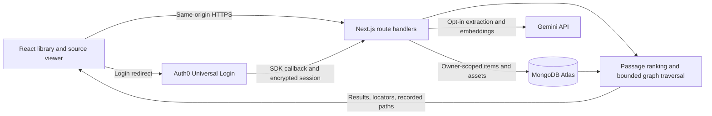

# Engineering instructions

## Product contract

Build a personal knowledge workspace where a user saves notes, documents, images, articles, and video; searches precise passages; follows weighted connections; and sees the actual path and evidence for each discovery. Originals and user-authored text are the source of truth. The graph and embeddings are rebuildable indexes.

The first implementation is in this repository. Continue from it rather than replacing the functional demo with a static mockup.

## Stack and connections

Use **TypeScript + React + Next.js App Router** for this MVP. TypeScript gives shared API types; React provides interactive editing and graph components; CSS controls the visual quality. Next.js route handlers keep secrets and retrieval on the server without a second application. A Python worker is appropriate later for FFmpeg, robust PDF parsing, or local transcription, but is not needed to run the current demo.



Auth0 supplies identity. MongoDB stores application data. Do not introduce another login provider. The browser never talks directly to MongoDB or receives API keys.

## Frontend instructions

1. Preserve the three working areas: library/type filters; search, cards, and source editor; related graph and explanations.
2. Use one Add content dialog with Write a note, Upload a file, and Paste a link. Validate before upload and preserve inputs when a request fails.
3. Make every library card open a source. Show page/timestamp labels and original access where available. AI descriptions must remain labeled. Keep raw Markdown editable and exportable.
4. Show real counts and processing results. Clearly separate illustrative demo sources from private user content. Never turn a missing key into a fake successful extraction.
5. The graph uses a 3D spring layout with orbit/pan/zoom, hover details, and a keyboard source selector. Stronger edges are thicker/brighter; weak edges are dashed. Hover reveals relationship type. Display a connection score, never an accuracy percentage.
6. Render the explanation returned by retrieval. Do not ask an LLM to invent a path after the fact.
7. On small screens, stack the connections panel below the main content. A dedicated Notes/Search/Connections tab layout can follow if usability testing calls for it.

## Answer-first interaction

The question box now calls `POST /api/answer`. This applies owner-scoped retrieval, selects up to six source passages, and asks Gemini for one cohesive response. Each factual paragraph must cite supplied source IDs. Unknown IDs and missing citations are rejected. Citations open the original passage and its recorded retrieval path. This structural validation does not establish factual entailment. Without a Gemini key, the app shows a labeled extractive preview; no answer is invented for an empty retrieval.

## Current server contracts

All private routes require the Auth0 session. Mutating requests must have an Origin matching `APP_BASE_URL`. Owner identity comes from `session.user.sub`, never a browser-supplied owner ID.

| Route                      | Request                                               | Result                                                 |
| -------------------------- | ----------------------------------------------------- | ------------------------------------------------------ |
| `GET /api/items`           | Session                                               | Items without vectors/assets; derived graph            |
| `POST /api/items`          | `{title, content, tags}`                              | Created note                                           |
| `PATCH /api/items/:id`     | `{title, content, tags, version}`                     | Updated note; 409 for stale version                    |
| `DELETE /api/items/:id`    | Session + same-origin request                         | Deletes owned item and embedded original               |
| `POST /api/import`         | Multipart `file`, `consent`; or JSON `{url, consent}` | Extracted and indexed item                             |
| `GET /api/items/:id/asset` | Session                                               | Owned original, private/no-store                       |
| `POST /api/answer`         | `{query, type, tag?}`                                 | One answer, citations, and retrieval evidence          |
| `POST /api/search`         | `{query, type, tag?}`                                 | Results, paths, graph, retrieval and embedding timings |
| `GET /api/me`              | Session                                               | Minimal user identity                                  |
| `GET /api/health`          | None                                                  | Service liveness, not provider readiness               |

Malformed input is rejected. Billed operations share a MongoDB-backed 20-request/minute account limit. URL import permits HTTPS, checks all resolved addresses, pins the connection to a validated address, validates redirects, and bounds response size/time. Original files require ownership checks just like search results.

## Data model

The MVP uses one `items` collection. A document has a UUID `_id`, `ownerId`, title, type, content, tags, timestamps, version, source URL, and segments. A segment has text, kind, a source locator, and optionally an embedding plus model identifier. Small original files are MongoDB Binary fields. Asset bytes and vectors are omitted from listing responses.

Separate collections for items, assets, segments, jobs, persisted edges, and edge overrides are the next migration when background processing is introduced. Use a workspace ID plus membership checks before adding collaboration; do not reinterpret owner IDs as shared workspaces.

## Retrieval behavior

The current graph uses:

```text
edge weight = 0.65 * similarity + 0.25 * explicit link + 0.10 * tag Jaccard
```

Similarity is cosine between compatible note vectors when present; otherwise it is lexical overlap. The API/UI label which basis was used. Averages of segment vectors approximate note-level similarity in this prototype.

Direct results use keyword coverage, or a 75/25 semantic/keyword combination for passages with compatible vectors. The best passage represents each item. Up to five direct results seed traversal. All direct results remain candidates, including isolated notes.

Traversal uses a priority queue represented by a sorted bounded array. Limits: depth 2, 15 neighbors per node, 40 expanded nodes, and 200 neighbor scores. It records the best observed discovery path, prevents cycles, and uses:

```text
priority = (0.15 + 0.85 * direct relevance) * product(edge weights) * 0.8^depth
```

The small graph bonus allows an indirect neighbor with no keyword overlap to appear as a connected discovery. It is a heuristic, not A*, calibrated confidence, or evidence that graph search outperforms vector search. Final results are capped at 20.

## Next implementation milestones

1. **Validate providers:** complete an actual Auth0 login/logout; create two accounts and verify isolation across items, files, imports, and search; save/reload notes; provoke a stale-version conflict; ingest one PDF/image/video using non-sensitive test material.
2. **Durable ingestion:** add private R2 uploads with narrowly scoped signed URLs; verify byte size and MIME after upload; atomically create an item and job; worker claims jobs with leases, retries, cancellation, idempotency, and per-item version checks. Keep last good index until replacement succeeds. UI polls real job progress.
3. **Faithful media:** extract PDF text page by page, use OCR for scans, generate separate visual descriptions, and transcribe videos with timestamped segments. Retain originals and complete transcripts. Use source page/frame checks before trusting model-proposed locations. Add a worker deployment independent of the web request lifetime.
4. **Indexed retrieval:** move embeddings to segment records and an Atlas vector index. Apply `ownerId` inside vector and keyword queries before ranking. Retrieve semantic candidates instead of constructing all pairwise edges. Preserve explicit links. Rebuild embeddings with a versioned model migration.
5. **User control:** store manual edge weights/suppressions separately from calculated edges. Add topic edits, ZIP import with traversal/bomb protection, and full library restore from exported data.
6. **Measure the claim:** label 30–50 queries and expected source passages. Compare keyword, semantic, and semantic+graph retrieval. Report top-five relevance, recall, p50/p95 latency, embedding latency, and scored/expanded counts. Do not claim a speed or quality win until measured.

Acceptance for the hackathon demo: save content; retrieve a precise passage; discover a useful indirect source; show its real path; open the original page or moment; show a second user cannot access it.
